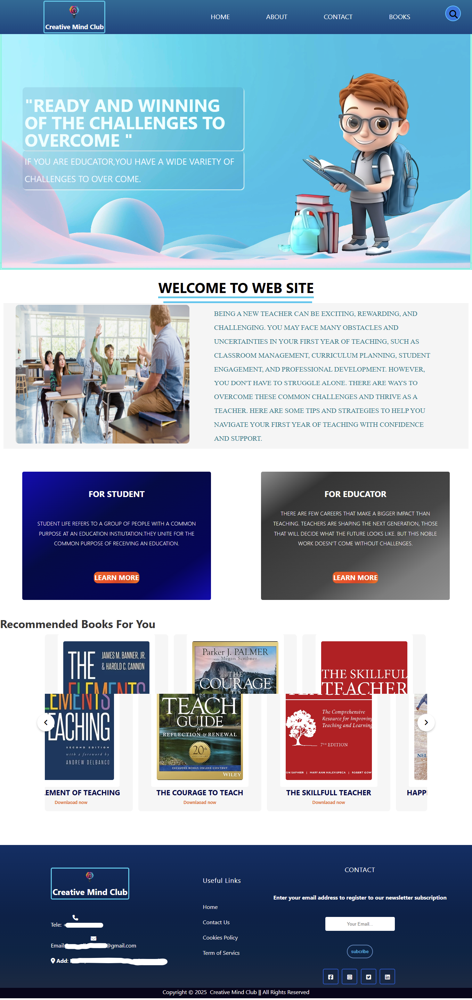

# Educational Blog Platform
A simple, static blog platform designed for **students and instructors** to share educational content, document learning journeys, and create professional academic portfolios. Built with modern web technologies for fast, responsive, and distraction-free blogging.

---

## 📸 Screenshots


---

## 📦 How to Run

1. **Clone the repository:**
   ```bash
   git clone https://github.com/APromadh404/StaticWebPage.git
   ```
---

## 🙋‍♂️ Author
- **AP** - [GitHub Profile](https://github.com/APromadh404)
---
⭐ **Star this repository if you found it helpful for your educational journey!**
---
